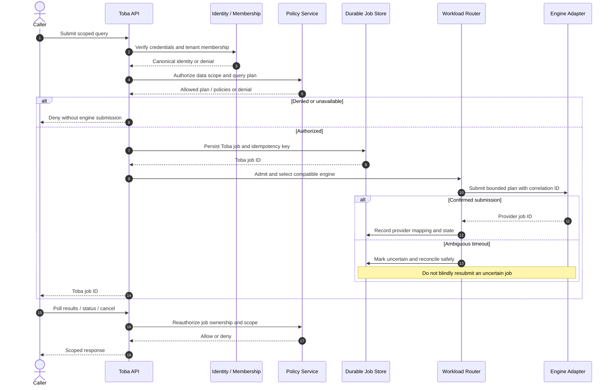

# Governed query execution — target sequence

```mermaid
sequenceDiagram
  autonumber
  actor Caller
  participant API as Toba API
  participant IAM as Identity / Membership
  participant Policy as Policy Service
  participant Jobs as Durable Job Store
  participant Router as Workload Router
  participant Engine as Engine Adapter
  Caller->>API: Submit scoped query
  API->>IAM: Verify credentials and tenant membership
  IAM-->>API: Canonical identity or denial
  API->>Policy: Authorize data scope and query plan
  Policy-->>API: Allowed plan / policies or denial
  alt Denied or unavailable
    API-->>Caller: Deny without engine submission
  else Authorized
    API->>Jobs: Persist Toba job and idempotency key
    Jobs-->>API: Toba job ID
    API->>Router: Admit and select compatible engine
    Router->>Engine: Submit bounded plan with correlation ID
    alt Confirmed submission
      Engine-->>Router: Provider job ID
      Router->>Jobs: Record provider mapping and state
    else Ambiguous timeout
      Router->>Jobs: Mark uncertain and reconcile safely
      Note over Jobs,Engine: Do not blindly resubmit an uncertain job
    end
    API-->>Caller: Toba job ID
  end
  Caller->>API: Poll results / status / cancel
  API->>Policy: Reauthorize job ownership and scope
  Policy-->>API: Allow or deny
  API-->>Caller: Scoped response
```

**Invariant:** A provider job ID never proves ownership. **Status:** required end-to-end behavior; test each branch before marking complete.
